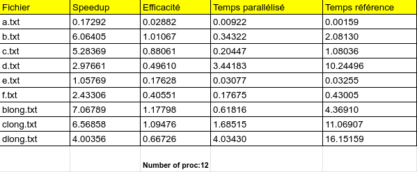

# Projet : simulateur de circulation

Hicheme BEN GAIED et Ahmet Sefa ULUCAN

## Présentation du sujet

Le but de ce projet était de paralléliser et optimiser le code fourni. Ce code a été produit par l'équipe Biebeleskaes, composée de Harenome Razanajato, Cédric Bastoul et Vincent Loechner, à l'occasion du Google Hashcode 2021.

Le code a été écrit dans des délais restreints, il n'est donc pas totalement documenté. Sa compréhension et sa prise en main sont donc deux étapes clés pour réussir à accélérer le programme.

Nous pouvons modifier librement tout le programme entre les appels de ```solution_check()``` et ```solution_score()``` dans ```checker.c```.

## Méthode de test

Pour tester nos performances, nous avons simplement repris la méthode du calcul du speedup et de l'efficacité des TP d'OpenMP.

Grâce à ```omp_get_wtime()```, nous mesurons le temps écoulé entre l'appel à ```solution_check()``` et la fin de l'appel à ```solution_score()```. Ces fonctions sont en double : une version originale et une version ```kernel``` qui est parallélisée. Nous pouvons ainsi comparer les temps entre la version séquentielle et la version parallélisée. Si le score des deux versions sont les mêmes, c'est que la parallélisation est fonctionnelle, permet au moins d'obtenir la même valeur.

De ces données, nous tirons un speedup et une efficacité qui sont deux métriques importantes pour connaître la qualité de notre parallélisation.

Tous les tests seront sont réalisés sur Turing qui dispose d'un plus grand nombre de coeur (12) comparé à nos machines respectives (4).

## Analyse du code et parallélisation

Une première lecture du code nous permet de nous rendre compte à quel point le style diffère entre nos productions scolaires et les productions d'industriels. 

Nous pouvons remarquer que la majorité des instructions sont exécutées dans des boucles ```for```. Notre première idée a donc été de paralléliser celles-ci. \
Après plusieurs essais, nous avons convenu que la méthode optimale était de paralléliser les boucles suivantes : \
\* ```for(int i=0; i<nb_inter_sol; i++)``` dans ```solution_check()``` \
\* ```for (int street = 0; street < p->S; street++)``` dans ```simulation_dequeue()``` \
\* ```for (int i = 0; i < s->A; i++)``` dans ```simulation_run()```

De plus, nous avons remarqué qu'un tri était effectué sur ```p->table``` lors de l'appel à ```treet_table_find_name()```. Cependant, ce tri a besoin d'être fait qu'une fois, c'est pourquoi nous avons décidé de le sortir de la boucle et de faire un appel au tri avant celle-ci. Nous avons donc ```p->table = street_table_sort_ids(p->table);``` juste avant la première boucle ```for``` de ```solution_check()```.

### solution_check()

En analysant le contenu de cette boucle, nous nous sommes rendus compte que la variable ```errors``` subissaient une incrémentation. Nous avons donc appliqué une reduction sur celle-ci pour avoir une copie privée sur chaque thread et garder une valeur cohérente lors de la parallélisation.

On arrive alors à la directive suivante : 

```c
#pragma omp parallel for reduction(+:errors)
for(int i=0; i<nb_inter_sol; i++)
{
    // vérifie la solution pour l'intersection num i : s->schedule[i]
    if(s->schedule[i].nb < 1) { ... }
    ...
}
```

### simulation_dequeue()

Cette fonction libère une place en enlevant une voiture de la file d'attente d'une rue. Comme chaque rue est unique et que l'index de la rue est la variable d'itération, nous pouvons appliquer une parallélisation sans craindre d'avoir des erreurs.

On obtient alors la directive : 

```c
#pragma omp parallel for
for (int street = 0; street < p->S; street++) {
// If there is a street to dequeue
    if (street_state[street].out == 1) { ... }
    ...
}
```

### simulation_run()

L'appel à la fonction ```simulation_update_intersection_lights()``` met à jour la couleur des feux d'intersections. Il change donc des valeurs dans la structure ```solution_t``` via un pointeur. L'ordre dépend de ```i``` et comme il s'agit de la variable d'itération, nous pouvons dire que paralléliser cette boucle n'entrainera pas de changement involontaire car ```i``` est une variable privée par défaut.

Nous avons donc cette directive : 

```c
#pragma omp parallel for
for (int i = 0; i < s->A; i++) {
    simulation_update_intersection_lights(s, i, T);
}
```

Nous avons aussi essayé de paralléliser cette boucle avec une reduction sur ```score```: 

```c
// Update car state
for (int c = 0; c < p->V; c++) {
    score += simulation_update_car(p, c, T);
}
```
Mais cette idée a été rapidement abandonnée car les résultats diffèraient avec la version séquentielle.


## Analyse des résultats

Nous avons lancé une dizaine de test sur Turing pour obtenir une moyenne de valeurs de temps d'exécution, de speedups et d'efficacité.

Les résultats sont les suivants : 



Voici un graphe de speedup, d'efficacité et de temps d'exécution en fonction du nombre de proc sur le fichier ```dlong.txt```.


Nous remarquons que la version parallélisée est bien plus rapide sur les gros jeux de données, 7 fois plus rapide dans le meilleur des cas (blong) et en moyenne 4. 

Sur les petits jeux, le programme est plus lent, ce qui est expliqué par le fait que créer des threads et les faire travailler est plus long que d'exécuter en séquentiel. 

De plus, sur le graphe de ```dlong.txt```, nous pouvons remarquer que le speedup ne change pas entre 8 threads et 12 threads. On peut donc dire que le speedup max est atteint à partir de 8 threads. 

Cependant, nous pouvons voir que l'efficacité n'est pas proche de 1 dans certains cas, ce qui veut dire qu'on n'atteint pas l'accélération maximale sur cette machine.